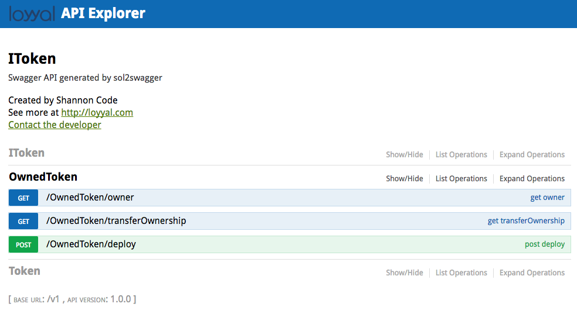
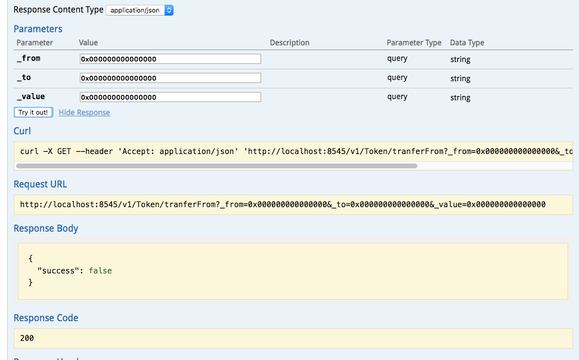
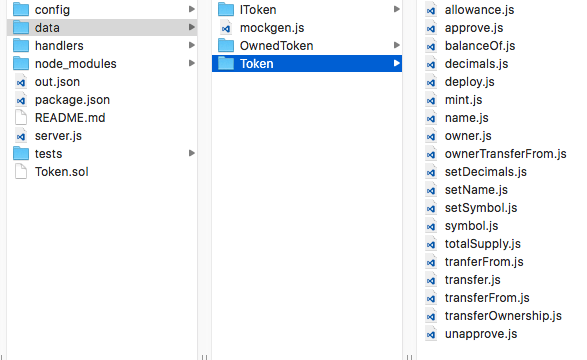

# sol2swagger
Convert Solidity files and Interface ABI to Swagger specifications

## Install
```
npm install https://github.com/loyyal/sol2swagger.git -g
```

# Instructions

```
sol2swagger SomeFile.sol
```

Will result in an openapi (Swagger 2.0) specification of the provided contract being printed to the screen.

```
sol2swagger SomeFile.sol >> out.json
```

This allows piping to another program or echoing to a file.

```
sol2swagger SomeFile.sol -s
```

This will run a Swagger UI site locally to let you inspect your newly generated specification


# Bonus (experimental)

## Yeoman
```
     _-----_     ╭───────────────────────╮
    |       |    │        Yo can do      │
    |--(o)--|    │       Ethereum too    │
   `---------´   │                       │
    ( _´U`_ )    │    http://yeoman.io   │
    /___A___\   /╰───────────────────────╯
     |  ~  |     
   __'.___.'__   
 ´   `  |° ´ Y ` 
```

If you have already converted SomeFile.sol to out.json you can actually generate a mocked out skeleton API. Be careful to be in a folder you want generated files to be placed.

### Install the generator
```
npm install https://github.com/synrg-labs/generator-sol2solidity.git -g
```

### Generate your spec and working mock API

```
sol2swagger SomeFile.sol -s -g
```

Wait a few minutes and you will be presented with the familiar Swagger UI viewer.


Wait a few more minutes for your new API to generate and you can now interact with the UI and have values returned based on the shape and types described in the swagger specification



You can modify the resulting nodejs application as you see fit. 



## Help
```
-s, --server           Serves swagger inside Swagger UI webserver
-p, --port [PORT]      Specifies the port to serve Swagger UI
-f, --file [FILENAME]  Specify where to write the generated swagger file
-h, --help             This menu
-g, --generate         Run the API Generator tool
```


